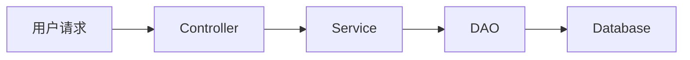

# 设计文档模板

<!-- TOC START -->

## 目录

- [文档信息](#文档信息)
- [1. 背景与目标](#1-背景与目标)
  - [1.1 问题背景](#1-1-问题背景)
  - [1.2 设计目标](#1-2-设计目标)
  - [1.3 非目标](#1-3-非目标)
- [2. 需求分析](#2-需求分析)
  - [2.1 功能需求](#2-1-功能需求)
  - [2.2 用户故事](#2-2-用户故事)
  - [2.3 边界场景](#2-3-边界场景)
- [3. 架构设计](#3-架构设计)
  - [3.1 整体流程](#3-1-整体流程)
  - [3.2 模块划分](#3-2-模块划分)
  - [3.3 关键算法/策略](#3-3-关键算法-策略)
- [4. 数据库设计](#4-数据库设计)
  - [4.1 表结构变更](#4-1-表结构变更)
  - [4.2 索引设计](#4-2-索引设计)
  - [4.3 数据迁移方案](#4-3-数据迁移方案)
- [5. API 接口设计](#5-api-接口设计)
  - [5.1 接口列表](#5-1-接口列表)
  - [5.2 请求/响应示例](#5-2-请求-响应示例)
- [6. 异常处理](#6-异常处理)
- [7. 性能考量](#7-性能考量)
  - [7.1 性能目标](#7-1-性能目标)
  - [7.2 性能优化点](#7-2-性能优化点)
- [8. 安全考量](#8-安全考量)
  - [8.1 权限控制](#8-1-权限控制)
  - [8.2 数据安全](#8-2-数据安全)
  - [8.3 防攻击](#8-3-防攻击)
- [9. 测试方案](#9-测试方案)
  - [9.1 单元测试](#9-1-单元测试)
  - [9.2 集成测试](#9-2-集成测试)
  - [9.3 回归测试](#9-3-回归测试)
- [10. 上线方案](#10-上线方案)
  - [10.1 上线步骤](#10-1-上线步骤)
  - [10.2 灰度策略](#10-2-灰度策略)
  - [10.3 监控告警](#10-3-监控告警)
- [11. 回滚方案](#11-回滚方案)
  - [11.1 回滚触发条件](#11-1-回滚触发条件)
  - [11.2 回滚步骤](#11-2-回滚步骤)
  - [11.3 数据补救](#11-3-数据补救)
- [评审记录](#评审记录)
- [变更记录](#变更记录)

<!-- TOC END -->

> 本文档是所有功能开发的强制模板。**任何代码编写前必须先完成设计文档并通过评审**。

---

## 文档信息

| 项       | 内容          |
| -------- | ------------- |
| 功能名称 | 请填写        |
| 文档版本 | v1.0          |
| 创建日期 | YYYY-MM-DD    |
| 设计人   | 请填写        |
| 评审状态 | 待评审/已通过 |
| 评审人   | 请填写        |

---

## 目录

1. [背景与目标](#1-背景与目标)
2. [需求分析](#2-需求分析)
3. [架构设计](#3-架构设计)
4. [数据库设计](#4-数据库设计)
5. [API 接口设计](#5-api-接口设计)
6. [异常处理](#6-异常处理)
7. [性能考量](#7-性能考量)
8. [安全考量](#8-安全考量)
9. [测试方案](#9-测试方案)
10. [上线方案](#10-上线方案)
11. [回滚方案](#11-回滚方案)

---

## 1. 背景与目标

### 1.1 问题背景

为什么要做这个功能？解决什么问题？

### 1.2 设计目标

这个功能要达到什么效果？关键指标是什么？

### 1.3 非目标

明确列出**不做**什么，避免范围蔓延。

---

## 2. 需求分析

### 2.1 功能需求

列出所有需要实现的功能点：

- [ ] 功能点 1
- [ ] 功能点 2
- [ ] 功能点 3

### 2.2 用户故事

```
作为 [角色]，我希望 [功能]，以便 [价值]。
```

### 2.3 边界场景

列出需要特别处理的边界情况：

- 空数据怎么办？
- 超大文件怎么办？
- 并发访问怎么办？
- 网络超时怎么办？

---

## 3. 架构设计

### 3.1 整体流程



### 3.2 模块划分

| 模块          | 职责                             |
| ------------- | -------------------------------- |
| XXXController | 参数校验、权限校验、返回结果封装 |
| XXXService    | 核心业务逻辑                     |
| XXXDAO        | 数据访问                         |
| XXXTask       | 异步任务处理                     |

### 3.3 关键算法/策略

如果涉及核心算法或复杂策略，在此详细说明。

---

## 4. 数据库设计

### 4.1 表结构变更

```sql
-- 新建表或修改表的 DDL
CREATE TABLE xxx (
    id          BIGSERIAL PRIMARY KEY,
    tenant_id   BIGINT NOT NULL,
    ...
);
```

### 4.2 索引设计

```sql
CREATE INDEX idx_xxx ON xxx(tenant_id, created_at);
```

### 4.3 数据迁移方案

如果涉及存量数据迁移，详细说明迁移方案。

---

## 5. API 接口设计

### 5.1 接口列表

| 接口 | Method | 路径          | 权限     |
| ---- | ------ | ------------- | -------- |
| 创建 | POST   | /api/xxx      | 登录用户 |
| 查询 | GET    | /api/xxx/{id} | 登录用户 |
| 修改 | PUT    | /api/xxx/{id} | 管理员   |
| 删除 | DELETE | /api/xxx/{id} | 管理员   |

### 5.2 请求/响应示例

**请求**

```json
{
  "name": "xxx",
  "type": 1
}
```

**响应**

```json
{
  "code": 0,
  "data": {
    "id": 123,
    "name": "xxx"
  },
  "msg": "success"
}
```

---

## 6. 异常处理

| 异常场景   | 错误码 | 提示信息             | 处理方式            |
| ---------- | ------ | -------------------- | ------------------- |
| 参数非法   | 400    | 参数错误             | 直接返回            |
| 无权限     | 403    | 无操作权限           | 记录审计日志        |
| 资源不存在 | 404    | 资源不存在           | 记录审计日志        |
| 系统异常   | 500    | 系统繁忙，请稍后重试 | 告警 + 记录错误日志 |

---

## 7. 性能考量

### 7.1 性能目标

| 场景             | 指标    |
| ---------------- | ------- |
| 单次请求响应时间 | < 200ms |
| 并发支持         | 100 QPS |
| 最大处理数据量   | 10万行  |

### 7.2 性能优化点

- 数据库查询是否需要加索引？
- 是否需要缓存？缓存失效策略是什么？
- 是否需要异步处理？
- 是否需要分批处理？

---

## 8. 安全考量

### 8.1 权限控制

- 什么角色可以访问？
- 跨租户数据隔离如何保证？

### 8.2 数据安全

- 是否涉及敏感数据？是否需要加密？
- 是否需要脱敏展示？
- 是否需要记录审计日志？

### 8.3 防攻击

- 如何防止 SQL 注入？
- 如何防止 XSS 攻击？
- 如何防止 CSRF 攻击？
- 如何防止重复提交？

---

## 9. 测试方案

### 9.1 单元测试

| 测试用例 | 说明         |
| -------- | ------------ |
| 正常流程 | 核心功能验证 |
| 参数为空 | 边界测试     |
| 参数非法 | 异常测试     |
| 无权限   | 权限测试     |

### 9.2 集成测试

- 完整链路测试
- 并发测试
- 性能测试

### 9.3 回归测试

列出可能受影响的已有功能。

---

## 10. 上线方案

### 10.1 上线步骤

1. 执行 SQL
2. 部署后端
3. 部署前端
4. 配置开关
5. 验证功能

### 10.2 灰度策略

是否需要灰度？灰度比例？灰度人群？

### 10.3 监控告警

上线后需要监控什么指标？什么情况下需要告警？

---

## 11. 回滚方案

### 11.1 回滚触发条件

什么情况下需要回滚？

- 核心功能不可用
- 数据错误
- 性能不达标
- 安全问题

### 11.2 回滚步骤

1. 关闭功能开关
2. 回滚前端
3. 回滚后端
4. 回滚数据（如需要）

### 11.3 数据补救

如果上线后产生了脏数据，如何清理和补救？

---

## 评审记录

| 评审人 | 评审日期 | 意见 | 状态   |
| ------ | -------- | ---- | ------ |
|        |          |      | 待评审 |

---

## 变更记录

| 版本 | 日期 | 修改人 | 修改内容 |
| ---- | ---- | ------ | -------- |
| v1.0 |      |        | 初始版本 |

---

> 📌 设计文档完成标准：
>
> 1. 一个合格的开发者拿到这篇文档就能开始写代码
> 2. 不需要再问"这个地方怎么做"这类问题
> 3. 所有关键决策点都已经明确
