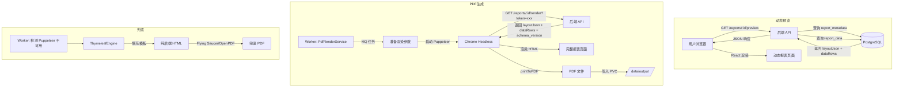

# 动静同构报表展示模块设计

<!-- TOC START -->

## 目录

- [文档信息](#文档信息)
- [1. 背景与目标](#1-背景与目标)
  - [1.1 问题背景](#1-1-问题背景)
  - [1.2 设计目标](#1-2-设计目标)
  - [1.3 非目标](#1-3-非目标)
- [2. 需求分析](#2-需求分析)
  - [2.1 功能需求](#2-1-功能需求)
  - [2.2 用户故事](#2-2-用户故事)
  - [2.3 边界场景](#2-3-边界场景)
- [3. 架构设计](#3-架构设计)
  - [3.1 同构原理](#3-1-同构原理)
  - [3.2 整体流程](#3-2-整体流程)
  - [3.3 模块划分](#3-3-模块划分)
  - [3.4 动态模式数据流](#3-4-动态模式数据流)
  - [3.5 静态模式数据流](#3-5-静态模式数据流)
  - [3.6 Thymeleaf 兜底渲染](#3-6-thymeleaf-兜底渲染)
- [4. 报表组件设计](#4-报表组件设计)
  - [4.1 组件规范](#4-1-组件规范)
  - [4.2 核心报表组件](#4-2-核心报表组件)
  - [4.3 组件示例](#4-3-组件示例)
  - [4.4 组件注册表](#4-4-组件注册表)
- [5. 打印分页控制](#5-打印分页控制)
  - [5.1 CSS 分页策略](#5-1-css-分页策略)
  - [5.2 分页标记组件](#5-2-分页标记组件)
- [6. 预览页面设计](#6-预览页面设计)
  - [6.1 动态预览页](#6-1-动态预览页)
  - [6.2 静态渲染页（供 Puppeteer 使用）](#6-2-静态渲染页供-puppeteer-使用)
  - [6.3 printMode 参数行为](#6-3-printmode-参数行为)
  - [6.4 历史版本渲染](#6-4-历史版本渲染)
- [7. 数据库设计](#7-数据库设计)
  - [7.1 表结构变更](#7-1-表结构变更)
  - [7.2 索引设计](#7-2-索引设计)
- [8. API 接口设计](#8-api-接口设计)
  - [8.1 接口列表](#8-1-接口列表)
  - [8.2 请求/响应示例](#8-2-请求响应示例)
- [9. 报表配置设计](#9-报表配置设计)
  - [9.1 报表布局配置 JSON](#9-1-报表布局配置-json)
  - [9.2 报表列配置 JSON](#9-2-报表列配置-json)
- [10. 异常处理](#10-异常处理)
- [11. 性能考量](#11-性能考量)
  - [11.1 性能目标](#11-1-性能目标)
  - [11.2 性能优化点](#11-2-性能优化点)
- [12. 安全考量](#12-安全考量)
  - [12.1 权限控制](#12-1-权限控制)
  - [12.2 数据安全](#12-2-数据安全)
  - [12.3 防攻击](#12-3-防攻击)
- [13. 测试方案](#13-测试方案)
  - [13.1 单元测试](#13-1-单元测试)
  - [13.2 集成测试](#13-2-集成测试)
  - [13.3 回归测试](#13-3-回归测试)
- [14. 上线方案](#14-上线方案)
  - [14.1 上线步骤](#14-1-上线步骤)
  - [14.2 灰度策略](#14-2-灰度策略)
  - [14.3 监控告警](#14-3-监控告警)
- [15. 回滚方案](#15-回滚方案)
  - [15.1 回滚触发条件](#15-1-回滚触发条件)
  - [15.2 回滚步骤](#15-2-回滚步骤)
  - [15.3 数据补救](#15-3-数据补救)
- [评审记录](#评审记录)
- [变更记录](#变更记录)

<!-- TOC END -->

---

## 文档信息

| 项       | 内容                 |
| -------- | -------------------- |
| 功能名称 | 动静同构报表展示模块 |
| 文档版本 | v1.0                 |
| 创建日期 | 2026-05-18           |
| 设计人   | 技术负责人           |
| 评审状态 | 待评审               |
| 评审人   | 待填写               |

---

## 1. 背景与目标

### 1.1 问题背景

锦书系统的核心卖点是"一套报表组件同时服务于网页浏览和 PDF 生成"。当前存在以下问题：

| 问题                     | 严重度  | 影响                                            |
| ------------------------ | ------- | ----------------------------------------------- |
| 报表组件未统一抽象       | 🔴 致命 | 网页预览和 PDF 渲染走两套代码路径，维护成本翻倍 |
| 报表布局配置无标准化     | 🔴 致命 | 无法通过元数据驱动渲染，每个报表需硬编码页面    |
| 打印分页控制不完整       | 🟡 高   | `print.scss` 仅定义了基本隐藏规则，缺少分页策略 |
| 无历史版本渲染能力       | 🟡 高   | `schema_version` 字段已存在于 DB 但前端未消费   |
| 报表数据获取方式不统一   | 🟡 高   | 动态模式走 API，静态模式需要另一套数据注入方案  |
| Thymeleaf 兜底方案未接入 | 🟡 高   | 概要设计已选定但未设计协作接口                  |

### 1.2 设计目标

| 指标           | 要求                                                   |
| -------------- | ------------------------------------------------------ |
| 组件复用率     | 动态/静态/PDF 三种输出模式 100% 复用同一组件代码       |
| 报表配置驱动   | 前端通过后端返回的 `layoutJson` 动态渲染，无需修改代码 |
| 打印分页       | 支持 CSS `page-break` 和组件级 `<PageBreak>` 标记      |
| 历史版本兼容   | schema_version 自动匹配对应版本的数据结构              |
| 预览响应时间   | ≤ 3 秒（含数据加载 + ECharts 渲染）                    |
| Thymeleaf 兜底 | 当 Puppeteer 渲染不可用时，纯后端输出可读 PDF          |

### 1.3 非目标

- 不实现 WYSIWYG 拖拽式报表设计器（三期功能，MVP 阶段使用 JSON 配置）
- 不实现报表组件实时协作编辑（如多人同时编辑同一报表布局）
- 不实现组件市场/插件系统（模板市场见 05-功能设计）
- 不实现 React SSR 方案 —— 已在概要设计中否决

---

## 2. 需求分析

### 2.1 功能需求

- [x] **报表组件注册表**：所有可用的报表组件（表格、柱状图、折线图、饼图、KPI 卡片、文本块）统一注册
- [x] **配置驱动渲染**：后端返回 `layoutJson`，前端根据配置动态渲染组件
- [x] **动态预览**：用户浏览器中实时通过 API 加载数据并渲染报表
- [x] **静态渲染页**：Puppeteer 直接访问预览页 URL，注入数据后输出 HTML → PDF
- [x] **打印分页控制**：组件级 `<PageBreak>` + 全局 CSS `page-break-inside: avoid`
- [x] **历史版本渲染**：前端根据 `schema_version` 匹配对应的数据列配置
- [x] **Thymeleaf 兜底渲染**：纯后端 HTML 模板 + 内联 CSS，独立于前端
- [x] **实时与静态数据切换**：同一组件支持 `dataMode='live'|'embedded'` 属性

### 2.2 用户故事

```
作为 制表人，我希望 通过配置 JSON 来定义报表的布局和内容，
以便 不需要写代码就能调整报表的列顺序、图表类型和分页位置。

作为 审查人，我希望 在浏览器中预览报表时看到的内容
与最终生成的 PDF 完全一致，以便 审查时不会遗漏任何格式问题。

作为 PDF 生成服务（Puppeteer），我希望 访问一个干净的预览页 URL，
这个页面已包含全部数据且隐藏了所有交互元素，
以便 直接调用 printToPDF 即可产出最终文件。

作为 审计员，我希望 查看三个月前发布的历史报表时，
其渲染效果与当时完全一致，以便 合规审计有据可查。
```

### 2.3 边界场景

| 场景                           | 处理方式                                                               |
| ------------------------------ | ---------------------------------------------------------------------- |
| 报表配置 JSON 格式错误         | 前端渲染占位组件"报表配置加载失败"，后端保存时校验 JSON Schema         |
| 图表数据为空                   | ECharts 显示空状态占位图 + 提示文字"暂无数据"                          |
| 单表超过 100 行                | 自动分页（每页 50 行），每页表格自动插入 `<PageBreak>`                 |
| 图表容器被跨页截断             | CSS `page-break-inside: avoid` + 组件级最小高度检测                    |
| Puppeteer 渲染超时             | 30s 超时 → 自动降级至 Thymeleaf 兜底渲染                               |
| 历史版本 schema_version 不匹配 | 按照旧版本配置渲染，若配置缺失则展示"该版本不支持在线预览，请下载 PDF" |
| 静态渲染时外部图片加载失败     | 所有图片转为 Base64 内嵌，禁止外部资源引用                             |
| 不同浏览器打印差异             | Puppeteer 使用固定 Chrome 版本（同 K8s 镜像），消除浏览器差异          |

---

## 3. 架构设计

### 3.1 同构原理

```
              ┌────────────────────────────────────────┐
              │         报 表 组 件 定 义               │
              │  ┌────────┐ ┌────────┐ ┌────────────┐  │
              │  │RptTable │ │RptChart│ │RptKpiCard  │  │
              │  │  (纯UI) │ │  (纯UI)│ │  (纯UI)    │  │
              │  └────────┘ └────────┘ └────────────┘  │
              │         ↑ props (数据)                    │
              └─────────┼──────────────────────────────┘
                        │
          ┌─────────────┼─────────────┐
          │             │             │
     ┌────┴─────┐ ┌────┴─────┐ ┌────┴─────┐
     │动态模式  │ │静态HTML  │ │Thymeleaf │
     │API拉取   │ │数据注入  │ │后端模板  │
     │实时渲染  │ │Puppeteer │ │纯后端    │
     │浏览器    │ │转PDF     │ │兜底      │
     └──────────┘ └──────────┘ └──────────┘
```

**核心原则**：报表组件是"纯展示组件"，不包含任何数据获取逻辑。数据通过 `props` 传入。三种模式的区别仅在于数据来源不同，组件本身是同一套代码。

### 3.2 整体流程



### 3.3 模块划分

| 模块                    | 位置                                                | 职责                                               |
| ----------------------- | --------------------------------------------------- | -------------------------------------------------- |
| ReportRenderController  | `backend/api/.../controller/`                       | 提供报表数据查询 API（动态预览 + 静态渲染）        |
| ReportRenderService     | `backend/api/.../service/`                          | 组装 layoutJson + dataRows，含 schema_version 适配 |
| ReportLayoutValidator   | `backend/common/.../`                               | 校验报表配置 JSON Schema                           |
| ReportRenderer          | `frontend/src/components/report/ReportRenderer.tsx` | 根据 layoutJson 动态渲染组件树                     |
| RptTable                | `frontend/src/components/report/RptTable.tsx`       | 表格组件（支持分页、排序、合计行）                 |
| RptChart                | `frontend/src/components/report/RptChart.tsx`       | 图表统一代理（Bar/Line/Pie）                       |
| RptKpiCard              | `frontend/src/components/report/RptKpiCard.tsx`     | KPI 指标卡片                                       |
| RptTextBlock            | `frontend/src/components/report/RptTextBlock.tsx`   | 文本块（标题、说明、签名栏）                       |
| RptPageBreak            | `frontend/src/components/report/RptPageBreak.tsx`   | 分页标记组件                                       |
| ThymeleafReportTemplate | `backend/api/.../templates/report.html`             | Thymeleaf 兜底模板                                 |

### 3.4 动态模式数据流

```
用户访问 /reports/:id/preview
       │
       ▼
ReportPreviewPage.tsx
  ├─ useEffect → reportService.getReportPreview(id)
  ├─ 后端 ReportRenderController → ReportRenderService
  │      ├─ 查询 report_metadata（获取 layoutJson, schema_version）
  │      └─ 查询 report_data（WHERE report_id = ? AND tenant_id = ?）
  │      └─ 组装返回 { layoutJson, dataRows, meta: { reportName, createdAt, ... } }
  │
  ▼ 前端收到数据
ReportRenderer.tsx
  ├─ 读取 layoutJson.components[]
  ├─ 遍历组件列表，根据 type 从注册表匹配组件
  ├─ 将对应数据作为 props 传入
  └─ React 渲染完整的报表页面
```

### 3.5 静态模式数据流（Puppeteer 渲染用）

```
Worker 收到 PDF 生成任务
       │
       ▼
PdfRenderService
  ├─ 确定渲染方案：Puppeteer（首选） / Thymeleaf（兜底）
  ├─ 生成内部 JWT Token（含 reportId + expire 5min）
  │
  ▼ Puppeteer 启动 Chrome
Chrome Headless
  ├─ 访问: GET https://frontend/reports/{id}/render?printMode=true&token={internalJwt}
  ├─ 后端 ReportRenderController
  │      ├─ 校验内部 JWT Token
  │      ├─ 不走用户鉴权（内部服务调用）
  │      ├─ 查询 report_metadata + report_data
  │      └─ 返回完整数据（一次性全量，不分页）
  │
  ▼ 前端 RenderPage.tsx
  ├─ 读取 URL params: printMode=true
  ├─ 隐藏 AppLayout（TopBar/Sidebar），渲染纯报表内容
  ├─ 使用 dataMode='embedded'，不从 API 拉数据，直接使用 props
  ├─ 等待所有图表渲染完成（ECharts animation: false）
  │
  ▼ Puppeteer 调用
  ├─ page.waitForSelector('#report-render-complete') — 等待渲染完成标记
  ├─ page.pdf({ printBackground: true, preferCSSPageSize: true, pageRanges: ... })
  └─ 输出 PDF 文件
```

### 3.6 Thymeleaf 兜底渲染

当 Puppeteer 不可用时（Chrome 实例耗尽、渲染超时 30s），自动降级：

```
PdfRenderService
  ├─ try Puppeteer 渲染
  ├─ catch (TimeoutException | BrowserUnavailableException)
  │
  ▼ 降级流程
  ├─ 查询 report_metadata.layoutJson
  ├─ 从 layoutJson 提取 components[] 的展示信息
  ├─ 注入 Thymeleaf 模板:
  │      <html>
  │        <head><style>/* 内联 CSS */</style></head>
  │        <body>
  │          <h1 th:text="${reportName}"></h1>
  │          <table th:each="component : ${components}">
  │            <!-- 仅支持表格和文本块，图表以占位符展示 -->
  │          </table>
  │        </body>
  │      </html>
  ├─ ThymeleafEngine.process(template, context) → 完整 HTML 字符串
  ├─ OpenPDF / Flying Saucer 将 HTML 转为 PDF
  └─ 输出兜底 PDF 文件（不含图表，但表格和数据完整）
```

> Thymeleaf 兜底 PDF 仅保证数据完整性，不保证排版 100% 一致。在 PDF 文件属性中标记 `fallback: true` 供用户知悉。

---

## 4. 报表组件设计

### 4.1 组件规范

所有报表组件必须遵循以下接口契约：

```typescript
// types/report.ts

/** 报表组件统一 Props 接口 */
interface ReportComponentProps {
  /** 组件配置（从 layoutJson.components[i].config 传入） */
  config: Record<string, unknown>;
  /** 组件数据（从 dataRows 中按 component.bindKey 提取） */
  data?: unknown;
  /** 数据模式：live=组件内部请求API, embedded=从父组件Props获取 */
  dataMode?: "live" | "embedded";
  /** 渲染完成回调（静态渲染时，组件渲染完成需通知父组件） */
  onRenderComplete?: () => void;
  /** 租户级配置（水印开关、脱敏规则等） */
  tenantConfig?: TenantRenderConfig;
}

/** 组件注册表条目 */
interface ReportComponentMeta {
  /** 组件类型标识（与 layoutJson.components[i].type 对应） */
  type: string;
  /** React 组件实现 */
  component: React.FC<ReportComponentProps>;
  /** 默认配置 */
  defaultConfig: Record<string, unknown>;
  /** 组件名称（展示用） */
  displayName: string;
  /** 支持的图表类型（仅图表类组件需设置） */
  supportedChartTypes?: string[];
}
```

### 4.2 核心报表组件

| 组件 `type`  | 组件类         | 说明                                    | 数据来源                   |
| ------------ | -------------- | --------------------------------------- | -------------------------- |
| `table`      | `RptTable`     | 数据表格，支持列排序、合计行、条件格式  | `bindKey` 对应的数据行数组 |
| `bar-chart`  | `RptChart`     | 柱状图（ECharts Bar）                   | `bindKey`                  |
| `line-chart` | `RptChart`     | 折线图（ECharts Line）                  | `bindKey`                  |
| `pie-chart`  | `RptChart`     | 饼图（ECharts Pie）                     | `bindKey`                  |
| `kpi-card`   | `RptKpiCard`   | KPI 指标卡片（数值 + 同比/环比 + 箭头） | `bindKey`                  |
| `text-block` | `RptTextBlock` | 富文本块（标题、说明文字、签名栏）      | 静态内容（config.content） |
| `page-break` | `RptPageBreak` | 显式分页标记                            | 无                         |
| `image`      | `RptImage`     | 图片展示（Logo、签章扫描件）            | Base64 内嵌                |

### 4.3 组件示例：RptTable

```typescript
// RptTable.tsx
interface RptTableConfig {
  columns: RptColumn[];          // 列定义
  pageSize: number;              // 每页行数（默认 50）
  showRowNumber: boolean;        // 是否显示行号
  showSummaryRow: boolean;       // 是否显示合计行
  summaryColumns: string[];      // 需要合计的列名
  conditionalFormat: ConditionalFormatRule[]; // 条件格式
}

interface RptColumn {
  field: string;                 // 数据字段名
  header: string;                // 列标题
  width: number;                 // 列宽（px 或 %）
  align: 'left' | 'center' | 'right';
  format?: 'number' | 'date' | 'currency' | 'percent';
  sortable: boolean;
}

const RptTable: React.FC<ReportComponentProps> = ({
  config,
  data,
  onRenderComplete
}) => {
  const { columns, pageSize = 50, showRowNumber, showSummaryRow, summaryColumns, conditionalFormat } = config as RptTableConfig;
  const rows = data as Record<string, unknown>[] ?? [];
  const pages = chunk(rows, pageSize);

  useEffect(() => {
    // 静态渲染模式下通知父组件"已渲染完成"
    onRenderComplete?.();
  }, []);

  return (
    <>
      {pages.map((pageRows, pageIndex) => (
        <React.Fragment key={pageIndex}>
          {pageIndex > 0 && <RptPageBreak />}
          <DataTable value={pageRows} size="small" className="rpt-table">
            {showRowNumber && <Column body={(_, { rowIndex }) => pageIndex * pageSize + rowIndex + 1} />}
            {columns.map(col => (
              <Column
                key={col.field}
                field={col.field}
                header={col.header}
                style={{ width: col.width, textAlign: col.align }}
              />
            ))}
          </DataTable>
        </React.Fragment>
      ))}
      {showSummaryRow && <RptTableSummary rows={rows} columns={summaryColumns} />}
    </>
  );
};
```

### 4.4 组件注册表

```typescript
// components/report/registry.ts

import RptTable from "./RptTable";
import RptChart from "./RptChart";
import RptKpiCard from "./RptKpiCard";
import RptTextBlock from "./RptTextBlock";
import RptPageBreak from "./RptPageBreak";
import RptImage from "./RptImage";

export const reportComponentRegistry: Record<
  string,
  React.FC<ReportComponentProps>
> = {
  table: RptTable,
  "bar-chart": RptChart,
  "line-chart": RptChart,
  "pie-chart": RptChart,
  "kpi-card": RptKpiCard,
  "text-block": RptTextBlock,
  "page-break": RptPageBreak,
  image: RptImage,
};

/** 获取已注册的组件 */
export function getReportComponent(
  type: string,
): React.FC<ReportComponentProps> {
  const Comp = reportComponentRegistry[type];
  if (!Comp) {
    console.warn(`Unknown report component type: ${type}`);
    return RptTextBlock; // 降级为文本块，显示 type 名称
  }
  return Comp;
}
```

---

## 5. 打印分页控制

### 5.1 CSS 分页策略

```scss
// assets/styles/report-print.scss

// 全局打印样式（在 print.scss 基础上补充报表专用）
@media print {
  // 报表容器
  .report-content {
    padding: 0;
    margin: 0;
  }

  // 表格行不断开
  .rpt-table tr,
  .rpt-table td {
    page-break-inside: avoid;
  }

  // 图表容器不断开
  .rpt-chart-container {
    page-break-inside: avoid;
    max-height: 95vh; // 确保不超出单页高度
    overflow: hidden;
  }

  // KPI 卡片组保持在同一页
  .rpt-kpi-row {
    page-break-inside: avoid;
  }

  // 分页标记
  .rpt-page-break {
    page-break-after: always;
    height: 0;
    margin: 0;
    padding: 0;
    visibility: hidden;
  }

  // 保留背景色和阴影
  .rpt-chart-container,
  .rpt-kpi-card {
    -webkit-print-color-adjust: exact;
    print-color-adjust: exact;
  }

  // 首页不需要标题页空白
  @page :first {
    margin-top: 0;
  }

  // 统一页边距
  @page {
    margin: 15mm 20mm;
    size: A4;
  }
}

// Puppeteer 渲染模式（非打印时也生效）
.report-render-mode {
  @extend .report-content;

  .rpt-page-break {
    page-break-after: always;
  }

  .rpt-chart-container {
    page-break-inside: avoid;
  }
}
```

### 5.2 分页标记组件

```typescript
// components/report/RptPageBreak.tsx
const RptPageBreak: React.FC<ReportComponentProps> = ({ onRenderComplete }) => {
  useEffect(() => {
    onRenderComplete?.();
  }, []);

  return <div className="rpt-page-break" data-page-break="true" />;
};
```

**三种分页方式**：

| 方式             | 机制                                                               | 适用场景             |
| ---------------- | ------------------------------------------------------------------ | -------------------- |
| 自动分页（表格） | `RptTable` 根据 `pageSize` 每 N 行插入 `<RptPageBreak>`            | 超过 50 行的数据表格 |
| 显式分页（配置） | 用户在 `layoutJson.components` 中手动插入 `{ type: 'page-break' }` | 不同业务章节之间     |
| CSS 强制避断     | `page-break-inside: avoid` 标记                                    | 图表容器、KPI 卡片组 |

---

## 6. 预览页面设计

### 6.1 动态预览页

URL: `GET /reports/:id/preview`

```
┌──────────────────────────────────────────────────────┐
│  TopBar （显示报表名称 + [编辑] [提交审查] [导出PDF]）│
├────────────┬─────────────────────────────────────────┤
│  Sidebar   │  ReportRenderer                         │
│            │  ┌─────────────────────────────────┐    │
│            │  │ RptTextBlock (报表标题)          │    │
│            │  ├─────────────────────────────────┤    │
│            │  │ RptKpiCard x 4 (核心指标行)      │    │
│            │  ├─────────────────────────────────┤    │
│            │  │ RptChart (月度趋势折线图)        │    │
│            │  ├─────────────────────────────────┤    │
│            │  │ RptPageBreak                     │    │
│            │  ├─────────────────────────────────┤    │
│            │  │ RptTable (明细数据表)             │    │
│            │  ├─────────────────────────────────┤    │
│            │  │ RptChart (部门占比饼图)          │    │
│            │  └─────────────────────────────────┘    │
└────────────┴─────────────────────────────────────────┘
```

组件行为：

- `ReportPreviewPage` 加载后调用 `GET /api/reports/{id}/preview`
- 获得 `{ layoutJson, dataRows, meta }` 后传给 `ReportRenderer`
- `ReportRenderer` 遍历 `layoutJson.components[]`，匹配注册表，渲染组件
- 每个组件设置 `dataMode='live'`

### 6.2 静态渲染页（供 Puppeteer 使用）

URL: `GET /reports/:id/render?printMode=true&token={internalJwt}`

与动态预览页的关键区别：

| 特性         | 动态预览 (preview)        | 静态渲染 (render)                                   |
| ------------ | ------------------------- | --------------------------------------------------- |
| URL          | `/reports/:id/preview`    | `/reports/:id/render`                               |
| 认证方式     | 用户 JWT（标准鉴权）      | 内部 JWT（`?token=`）                               |
| AppLayout    | 显示 TopBar + Sidebar     | 隐藏，仅渲染报表内容                                |
| 数据获取     | API 拉取（dataMode=live） | 后端在返回 HTML 时内嵌数据（dataMode=embedded）     |
| 图表动画     | 开启 ECharts 动画         | 关闭动画，渲染完成后发信号                          |
| 渲染完成通知 | 不需要                    | 在 DOM 末尾插入 `<div id="report-render-complete">` |
| 水印         | 可选（租户配置）          | 强制开启 PDF 隐式水印                               |

### 6.3 printMode 参数行为

```typescript
// pages/reports/RenderPage.tsx
const RenderPage: React.FC = () => {
  const [searchParams] = useSearchParams();
  const printMode = searchParams.get('printMode') === 'true';
  const token = searchParams.get('token');
  const { id } = useParams();

  const [reportData, setReportData] = useState<ReportRenderData | null>(null);
  const [renderComplete, setRenderComplete] = useState(false);

  useEffect(() => {
    // 静态渲染模式下，使用内部 Token 调用 API 获取全量数据
    reportService.getReportRenderData(id!, token!)
      .then(data => setReportData(data));
  }, [id, token]);

  // 监听所有子组件渲染完成
  const handleComponentComplete = useCallback(() => {
    // 简单实现：所有组件渲染完成后标记完成
    // 复杂实现：用一个计数器追踪每个组件的完成状态
    setRenderComplete(true);
  }, []);

  if (printMode) {
    return (
      <div className="report-render-mode">
        {reportData && (
          <ReportRenderer
            layoutJson={reportData.layoutJson}
            dataRows={reportData.dataRows}
            meta={reportData.meta}
            dataMode="embedded"
            onComponentComplete={handleComponentComplete}
          />
        )}
        {/* Puppeteer 等待此元素出现再截图 */}
        {renderComplete && <div id="report-render-complete" style={{ display: 'none' }} />}
      </div>
    );
  }

  // 动态预览模式（正常的 AppLayout 包裹）
  return (
    <AppLayout>
      {reportData && (
        <ReportRenderer
          layoutJson={reportData.layoutJson}
          dataRows={reportData.dataRows}
          meta={reportData.meta}
          dataMode="live"
        />
      )}
    </AppLayout>
  );
};
```

### 6.4 历史版本渲染

```typescript
// ReportRenderer.tsx — 版本适配逻辑
const ReportRenderer: React.FC<ReportRendererProps> = ({
  layoutJson,
  dataRows,
  meta,
  dataMode,
  onComponentComplete
}) => {
  // 如果后端返回的 schema_version 与当前前端支持的版本不一致
  // 前端需要做兼容处理（例如：旧版本缺少某些字段时使用默认值）
  const { schemaVersion } = meta;

  // 获取当前前端支持的 schema_version
  const supportedVersion = useMemo(() => getSupportedSchemaVersion(layoutJson.reportType), [layoutJson.reportType]);

  // 版本兼容逻辑
  const adaptedLayout = useMemo(() => {
    if (schemaVersion === supportedVersion) return layoutJson;
    return adaptLayoutForVersion(layoutJson, schemaVersion, supportedVersion);
  }, [layoutJson, schemaVersion, supportedVersion]);

  return (
    <div className="report-renderer">
      {adaptedLayout.components.map((component, index) => {
        const Comp = getReportComponent(component.type);
        const componentData = component.bindKey
          ? dataRows.filter(row => row._componentIndex === index)
          : undefined;

        return (
          <Comp
            key={`${component.type}-${index}`}
            config={component.config}
            data={componentData}
            dataMode={dataMode}
            onRenderComplete={() => onComponentComplete?.(index)}
          />
        );
      })}
    </div>
  );
};
```

---

## 7. 数据库设计

### 7.1 表结构变更

```sql
-- report_metadata 补充字段（部分字段已存在，此处仅列变更）

-- 1. 报表布局配置（核心新增）
ALTER TABLE report_metadata
  ADD COLUMN IF NOT EXISTS layout_json JSONB NOT NULL DEFAULT '{"version":1,"components":[]}';

COMMENT ON COLUMN report_metadata.layout_json IS '报表布局配置 JSON，包含 components[] 数组';

-- 2. 报表快照（用于历史版本渲染）
ALTER TABLE report_metadata
  ADD COLUMN IF NOT EXISTS schema_snapshot JSONB;

COMMENT ON COLUMN report_metadata.schema_snapshot IS '发布时的列配置快照（用于历史版本渲染兼容）';

-- 3. 报表类型
ALTER TABLE report_metadata
  ADD COLUMN IF NOT EXISTS report_type VARCHAR(50) NOT NULL DEFAULT 'custom';

COMMENT ON COLUMN report_metadata.report_type IS '报表类型：custom(自定义)/financial(财务)/sales(销售)/hr(人力)';

-- 4. 新建报表列定义表
CREATE TABLE IF NOT EXISTS report_column_def (
    id              BIGSERIAL PRIMARY KEY,
    tenant_id       BIGINT NOT NULL,
    report_id       BIGINT NOT NULL REFERENCES report_metadata(id),
    field           VARCHAR(100) NOT NULL,      -- 数据字段名
    header          VARCHAR(200) NOT NULL,      -- 列标题
    col_type        VARCHAR(30) NOT NULL DEFAULT 'text', -- number/date/currency/percent/text
    width           INTEGER DEFAULT 120,        -- 列宽
    align           VARCHAR(10) DEFAULT 'left', -- left/center/right
    sortable        BOOLEAN DEFAULT false,
    visible         BOOLEAN DEFAULT true,
    sort_order      INTEGER NOT NULL,           -- 列排序
    created_at      TIMESTAMP DEFAULT NOW(),
    updated_at      TIMESTAMP DEFAULT NOW(),

    UNIQUE(tenant_id, report_id, field)
);

CREATE INDEX idx_report_column_def_report ON report_column_def(tenant_id, report_id, sort_order);

COMMENT ON TABLE report_column_def IS '报表列定义表，描述报表数据的列结构';
```

### 7.2 索引设计

```sql
-- 已有索引可满足查询需求，无需额外索引
-- report_data 的查询走 idx_report_data_report_id
-- report_metadata 的查询走主键
```

---

## 8. API 接口设计

### 8.1 接口列表

| 接口           | Method | 路径                               | 权限       | 说明                             |
| -------------- | ------ | ---------------------------------- | ---------- | -------------------------------- |
| 动态预览数据   | GET    | `/api/reports/{id}/preview`        | 登录用户   | 返回 layoutJson + dataRows       |
| 静态渲染数据   | GET    | `/api/reports/{id}/render`         | 内部 Token | 返回全量嵌入数据（供 Puppeteer） |
| 保存报表布局   | PUT    | `/api/reports/{id}/layout`         | creater    | 更新 layoutJson                  |
| 获取报表列定义 | GET    | `/api/reports/{id}/columns`        | 登录用户   | 返回 column_def 列表             |
| 更新报表列定义 | PUT    | `/api/reports/{id}/columns`        | creater    | 批量更新列定义                   |
| 报表架构版本   | GET    | `/api/reports/{id}/schema-version` | 登录用户   | 返回当前 schema_version 和快照   |

### 8.2 请求/响应示例

**GET /api/reports/{id}/preview — 响应**

```json
{
  "code": 0,
  "message": "success",
  "data": {
    "meta": {
      "reportId": 1001,
      "reportName": "2026年5月销售月报",
      "reportType": "sales",
      "schemaVersion": 3,
      "createdBy": "张三",
      "createdAt": "2026-05-18T10:00:00Z",
      "status": "PUBLISHED"
    },
    "layoutJson": {
      "version": 1,
      "components": [
        {
          "type": "text-block",
          "config": {
            "content": "<h1>2026年5月销售月报</h1><p>制表人：张三 | 日期：2026-05-18</p>",
            "textAlign": "center"
          }
        },
        {
          "type": "kpi-card",
          "bindKey": "monthly_summary",
          "config": {
            "metrics": [
              {
                "label": "本月销售额",
                "field": "total_sales",
                "format": "currency"
              },
              {
                "label": "环比增长",
                "field": "mom_growth",
                "format": "percent"
              },
              { "label": "订单数", "field": "order_count", "format": "number" },
              {
                "label": "客单价",
                "field": "avg_order_value",
                "format": "currency"
              }
            ]
          }
        },
        {
          "type": "line-chart",
          "bindKey": "daily_trend",
          "config": {
            "title": "每日销售趋势",
            "xField": "date",
            "yField": "amount",
            "height": 400
          }
        },
        {
          "type": "page-break"
        },
        {
          "type": "table",
          "bindKey": "detail_data",
          "config": {
            "columns": [
              {
                "field": "order_no",
                "header": "订单号",
                "width": "15%",
                "align": "left"
              },
              {
                "field": "customer",
                "header": "客户",
                "width": "20%",
                "align": "left"
              },
              {
                "field": "amount",
                "header": "金额",
                "width": "12%",
                "align": "right",
                "format": "currency"
              },
              {
                "field": "order_date",
                "header": "日期",
                "width": "12%",
                "align": "center",
                "format": "date"
              },
              {
                "field": "sales_rep",
                "header": "销售代表",
                "width": "12%",
                "align": "left"
              },
              {
                "field": "status",
                "header": "状态",
                "width": "10%",
                "align": "center"
              }
            ],
            "pageSize": 50,
            "showRowNumber": true,
            "showSummaryRow": true,
            "summaryColumns": ["amount"]
          }
        },
        {
          "type": "page-break"
        },
        {
          "type": "pie-chart",
          "bindKey": "dept_distribution",
          "config": {
            "title": "部门销售占比",
            "nameField": "dept",
            "valueField": "amount",
            "height": 400
          }
        }
      ]
    },
    "dataRows": {
      "monthly_summary": {
        "total_sales": 12568000,
        "mom_growth": 0.152,
        "order_count": 3842,
        "avg_order_value": 3271.5
      },
      "daily_trend": [
        { "date": "2026-05-01", "amount": 320000 },
        { "date": "2026-05-02", "amount": 415000 }
      ],
      "detail_data": [
        {
          "_componentIndex": 3,
          "order_no": "SO-20260501-001",
          "customer": "XX科技",
          "amount": 50000,
          "order_date": "2026-05-01",
          "sales_rep": "李四",
          "status": "已完成"
        }
      ],
      "dept_distribution": [
        { "dept": "华东区", "amount": 5200000 },
        { "dept": "华南区", "amount": 4100000 }
      ]
    }
  }
}
```

**PUT /api/reports/{id}/layout — 请求**

```json
{
  "layoutJson": {
    "version": 2,
    "components": [
      { "type": "text-block", "config": { "content": "<h1>更新后的标题</h1>" } }
    ]
  }
}
```

> layoutJson 保存时后端必须校验 JSON Schema，确保 `components[]` 中的 `type` 在允许列表中。

---

## 9. 报表配置设计

### 9.1 报表布局配置 JSON Schema

```json
{
  "$schema": "http://json-schema.org/draft-07/schema#",
  "type": "object",
  "required": ["version", "components"],
  "properties": {
    "version": {
      "type": "integer",
      "description": "布局配置版本号"
    },
    "pageConfig": {
      "type": "object",
      "properties": {
        "pageSize": { "type": "string", "enum": ["A4", "A3", "Letter"] },
        "orientation": { "type": "string", "enum": ["portrait", "landscape"] },
        "marginTop": { "type": "number" },
        "marginBottom": { "type": "number" },
        "marginLeft": { "type": "number" },
        "marginRight": { "type": "number" }
      }
    },
    "components": {
      "type": "array",
      "items": {
        "type": "object",
        "required": ["type"],
        "properties": {
          "type": {
            "type": "string",
            "enum": [
              "table",
              "bar-chart",
              "line-chart",
              "pie-chart",
              "kpi-card",
              "text-block",
              "page-break",
              "image"
            ]
          },
          "bindKey": { "type": "string" },
          "config": { "type": "object" }
        }
      }
    }
  }
}
```

### 9.2 报表列配置 JSON

```json
[
  {
    "field": "order_no",
    "header": "订单号",
    "col_type": "text",
    "width": 150,
    "align": "left",
    "sortable": true,
    "visible": true,
    "sort_order": 1
  },
  {
    "field": "amount",
    "header": "金额",
    "col_type": "currency",
    "width": 120,
    "align": "right",
    "sortable": true,
    "visible": true,
    "sort_order": 3
  }
]
```

---

## 10. 异常处理

| 异常场景                      | 错误码 | 提示信息                         | 处理方式                                |
| ----------------------------- | ------ | -------------------------------- | --------------------------------------- |
| layoutJson 格式非法           | 400    | 报表布局配置格式错误             | 后端校验 JSON Schema，返回具体字段错误  |
| 组件 type 不在注册表          | 400    | 未知的报表组件类型：{type}       | 前端降级渲染为文本占位块                |
| bindKey 对应的数据不存在      | —      | 组件显示"暂无数据"               | 前端捕获空数据，显示空状态              |
| report_metadata 不存在        | 404    | 报表不存在                       | 返回 404，前端跳转 404 页               |
| schema_version 不兼容         | —      | 历史报表，可能有部分数据无法展示 | 前端按旧 schema 渲染，缺失列显示为 "-"  |
| Puppeteer 页面加载超时 (>30s) | —      | PDF 渲染降级为 Thymeleaf         | 自动切换兜底方案，PDF 属性标记 fallback |
| 图表渲染失败（ECharts 异常）  | —      | 图表区域显示"图表加载失败"       | ErrorBoundary 捕获，不阻塞其他组件渲染  |
| 数据量过大（> 10 万行）       | 400    | 数据量过大，请使用导出功能       | 预览 API 限制最多返回 5000 行           |
| 内部 Token 无效               | 401    | 无效的渲染 Token                 | 返回 401，Puppeteer 得不到数据 → 降级   |

---

## 11. 性能考量

### 11.1 性能目标

| 场景                   | 指标    |
| ---------------------- | ------- |
| 预览 API 响应时间      | < 500ms |
| 前端渲染时间（含图表） | < 2s    |
| 预览页完整渲染 (FCP)   | < 3s    |
| 单页图表渲染 (ECharts) | < 200ms |
| Puppeteer 页面加载完成 | < 10s   |

### 11.2 性能优化点

1. **组件级懒加载**：`ReportRenderer` 使用 `IntersectionObserver`，仅渲染视口内组件（动态模式），Puppeteer 模式下全量渲染
2. **ECharts 按需引入**：仅注册报表中实际使用的图表类型（Bar/Line/Pie），不引入全量 ECharts
3. **ECharts 渲染优化**：
   - `animation: false`（静态模式）
   - `renderer: 'canvas'`（大数据量使用 Canvas，小数据量可考虑 SVG）
   - `large: true` + `largeThreshold: 500`（超 500 数据点开启大数据量优化）
4. **表格虚拟滚动**：超 100 行表格使用 PrimeReact `DataTable` 的 `virtualScroller`（动态预览模式）
5. **数据分批返回**：预览 API 默认返回前 5000 行，超出部分提示"请使用导出功能查看完整数据"
6. **layoutJson 缓存**：保存在 `report_metadata` 中，查询报表时一并返回，避免额外 SQL
7. **ECharts 实例复用**：同一页面多次渲染同一类型图表时复用实例（`setOption` 而非 `dispose` + 新建）

---

## 12. 安全考量

### 12.1 权限控制

| 操作                        | 制表人 | 审查人 | 访客 | 平台管理员 |
| --------------------------- | :----: | :----: | :--: | :--------: |
| 查看动态预览                |   ✓    |   ✓    | ✓\*  |     ✓      |
| 编辑报表布局                |   ✓    |   ✗    |  ✗   |     ✓      |
| 访问静态渲染页（内部Token） |   —    |   —    |  —   |     —      |
| 查看历史版本                |   ✓    |   ✓    | ✓\*  |     ✓      |

> \* 访客仅可查看状态为 PUBLISHED 的报表

### 12.2 数据安全

- 静态渲染页面（`/render`）使用内部 JWT Token（有效期 5 分钟），不校验用户登录态
- 内部 Token 仅由 `PdfRenderService` 签发，签名密钥与用户 JWT 分离
- 预览 API 返回的数据受脱敏规则控制（如手机号、身份证由 MyBatis TypeHandler 自动脱敏）
- PDF 渲染 Token 禁止通过外网访问（K8s NetworkPolicy 限制仅 Worker Pod 可调用）

### 12.3 防攻击

- `layoutJson` 保存时后端校验 JSON Schema，防止注入非法组件类型
- `text-block` 的 `config.content` 在渲染前经过 DOMPurify 清洗（防 XSS）
- 预览 API 限制租户数据隔离（通过 `TenantContext` 自动注入），防止跨租户数据泄露
- 静态渲染页禁用外部资源加载（Puppeteer 设置 `blockedDomains`）

---

## 13. 测试方案

### 13.1 单元测试

| 测试用例                     | 说明                                     |
| ---------------------------- | ---------------------------------------- |
| ReportRenderer 空 components | 不渲染任何组件，页面不崩溃               |
| ReportRenderer 未知 type     | 降级渲染为 text-block 占位               |
| RptTable 空数据              | 显示 EmptyState "暂无数据"               |
| RptTable > 100 行            | 自动分页，每页 50 行，插入 PageBreak     |
| RptChart 空数据              | ECharts 显示 noData 占位图               |
| schema_version 适配          | 旧版本 layoutJson 正确转换为当前版本     |
| layoutJson Schema 校验       | 非法 JSON 被正确拒绝                     |
| RptPageBreak 渲染            | DOM 中包含 `data-page-break="true"` 属性 |

### 13.2 集成测试

| 测试用例           | 说明                                                                 |
| ------------------ | -------------------------------------------------------------------- |
| 动态预览完整链路   | 用户登录 → 访问预览页 → API 返回数据 → 页面渲染正确                  |
| 静态渲染页完整链路 | 内部 Token → 访问 render 页 → 数据返回 → 渲染完成标记出现            |
| Puppeteer PDF 渲染 | Worker 启动 Chrome → 访问 render 页 → printToPDF 成功 → PDF 文件非空 |
| Thymeleaf 兜底渲染 | 模拟 Puppeteer 不可用 → 自动降级 → 兜底 PDF 生成成功                 |
| 打印分页正确性     | HTML 生成后在 Puppeteer 中验证 PDF 总页数与预期一致                  |
| 历史版本渲染       | schema_version=1 的报表使用 v1 配置渲染，列结构正确                  |

### 13.3 回归测试

- 前端架构变更后，确保 printMode 行为不受影响（TopBar/Sidebar 正确隐藏）
- 报表列定义表变更后，确保已有报表的预览不崩溃
- ECharts 版本升级后，确保 charts 在 Puppeteer 中正确渲染（不出现空白图表）

---

## 14. 上线方案

### 14.1 上线步骤

1. **数据库迁移**：执行 `report_column_def` 建表 + `report_metadata` 补充字段（Flyway V3）
2. **后端部署**：
   - 部署 `ReportRenderController` + `ReportRenderService`
   - 部署 `ReportLayoutValidator`（JSON Schema 校验）
   - 部署 Thymeleaf 模板 `report.html`
3. **前端部署**：
   - 实现报表组件注册表 + 核心组件（RptTable, RptChart, RptKpiCard, RptTextBlock, RptPageBreak）
   - 实现 `ReportRenderer` + `RenderPage`
   - 发布 `report-print.scss`
4. **Worker 更新**：
   - `PdfRenderService` 接入静态渲染页 URL
   - 实现 Puppeteer → Thymeleaf 自动降级逻辑
5. **验证**：创建测试报表 → 配置 layoutJson → 动态预览 → 生成 PDF → 比对一致性

### 14.2 灰度策略

- 初期仅对新创建的报表启用 layoutJson 驱动渲染
- 存量报表（无 layoutJson）使用默认单表格布局兜底
- Puppeteer 渲染先在测试环境验证 72 小时稳定后再切生产

### 14.3 监控告警

| 监控项                   | 阈值     | 说明                          |
| ------------------------ | -------- | ----------------------------- |
| 预览 API P95 响应时间    | > 2s     | 可能数据量过大或 SQL 慢查询   |
| Puppeteer 渲染失败率     | > 5%     | 检查 Chrome 实例数或内存限制  |
| Thymeleaf 降级次数       | > 1/小时 | Pupeteer 可能大面积不可用     |
| 前端 JS 报错（组件渲染） | > 1%     | layoutJson 格式问题或组件 bug |

---

## 15. 回滚方案

### 15.1 回滚触发条件

- 预览页面大面积白屏（ReportRenderer 渲染异常）
- Puppeteer 渲染成功率 < 50%
- layoutJson 解析错误导致所有报表不可用

### 15.2 回滚步骤

1. 前端回退 `ReportRenderer` 组件，恢复为硬编码预览页
2. 后端保留 `layoutJson` 字段（数据不回滚），仅下线新 Controller
3. Worker 恢复为旧版 Thymeleaf 模板渲染

### 15.3 数据补救

- `layoutJson` 和 `report_column_def` 数据不回滚（新增字段不影响旧代码）
- 回滚期间生成的 PDF 使用 Thymeleaf 兜底方案，确保数据不丢失
- 故障修复后，重新对故障期间的报表补生成 PDF

---

## 评审记录

| 评审人 | 评审日期 | 意见 | 状态   |
| ------ | -------- | ---- | ------ |
|        |          |      | 待评审 |

---

## 变更记录

| 版本 | 日期       | 修改人 | 修改内容 |
| ---- | ---------- | ------ | -------- |
| v1.0 | 2026-05-18 |        | 初始版本 |

---

> 📌 设计文档完成标准：
>
> 1. 一个合格的开发者拿到这篇文档就能开始写代码
> 2. 不需要再问"这个地方怎么做"这类问题
> 3. 所有关键决策点都已经明确
